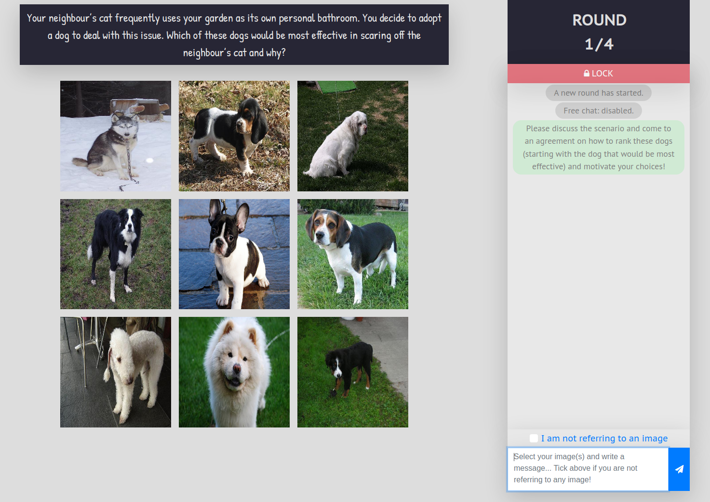
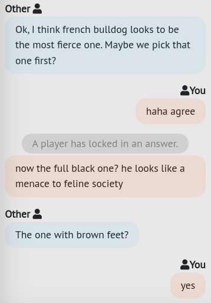

<p align="center">
    <br>
    
    <br>
<p>

Repository for the paper "[Collecting Visually-Grounded Dialogue with A Game Of Sorts](https://aclanthology.org/2022.lrec-1.242/)" presented at [LREC 2022](https://lrec2022.lrec-conf.org/en/). 
Please cite the following work if you use anything from this repository or from our paper:

```bibtex
@inproceedings{willemsen-etal-2022-collecting,
    title = "Collecting Visually-Grounded Dialogue with A Game Of Sorts",
    author = "Willemsen, Bram  and
      Kalpakchi, Dmytro  and
      Skantze, Gabriel",
    booktitle = "Proceedings of the Thirteenth Language Resources and Evaluation Conference",
    month = jun,
    year = "2022",
    address = "Marseille, France",
    publisher = "European Language Resources Association",
    url = "https://aclanthology.org/2022.lrec-1.242",
    pages = "2257--2268"
}
```

***

## :scroll: Overview

- [:speech_balloon: The Task](#the-task)
  - [Game UI :computer:](#game-ui)
  - [Dialogue Excerpt :mag_right:](#dialogue-excerpt)
- [:spaghetti: The Code](#the-code)
- [:page_facing_up: The Data](#the-data)
  - [Message :mag_right:](#message)
  - [Images :camera:](#images)
  - [Annotations :bookmark_tabs:](#annotations)
    - [Mentions :link:](#mentions)

***

## <a name="the-task"></a> :speech_balloon: The Task

*A Game Of Sorts* is a collaborative image ranking task. 
The default version of this "game" has two players tasked with reaching agreement on how to rank a set of nine images given some sorting criterion. 
Communication between players takes the form of a written dialogue which takes place under partial knowledge, as the position of the images on the gameboard is randomized and players cannot see each other's perspective. 
The game is played over four rounds with a recurring set of images. 
For a more detailed explanation of the game, we refer the reader to Section 3 of our [paper](https://aclanthology.org/2022.lrec-1.242.pdf).

### <a name="game-ui"></a> Game UI :computer:

<div align="center"> <p>Figure 1: User interface of the game during gameplay.</p></div>

Figure 1 provides an overview of the game's user interface. 
The gameboard consists of a sorting criterion, embedded in a scenario, and a set of nine images[^1], laid out in a 3x3 grid.
When a user hovers over an image with their mouse cursor, the image will pop over the other images, revealing a slightly zoomed-in version of the image in its original aspect ratio for improved visibility. 
To the right of the gameboard is the chat area. 
Before being able to send a message, the player is expected to indicate whether they are referencing one or more images in their message (i.e., *self-annotation*). 
To do so, they either select the image(s) in question on the gameboard by clicking on the referenced image(s) or they select the "*I'm not referring to an image*" option in case their message does not contain a reference to any of the images.
Above the chat area, a red button is visible that reads "*LOCK*": when the players have managed to reach an agreement on how to rank one or more of the images, they will need to click this button after having selected the image in question on the gameboard; note that images can only be locked in one at a time. 
If both players lock the same image, the image is assigned a rank; ranks are assigned in descending order. 
The assigned rank of a successfully ranked image cannot be changed.

### <a name="dialogue-excerpt"></a> Dialogue Excerpt :mag_right:

<div align="center"> <p>Figure 2: Excerpt of a dialogue.</p></div>

Figure 2 shows an excerpt of a dialogue in which the players discussed the scenario presented in Figure 1.

***

## <a name="the-code"></a> :spaghetti: The Code
The game's codebase can be found in the `./game` directory.
The application (client and server-side) is written in JavaScript and makes use of Embedded JavaScript ([EJS](https://ejs.co/)) templates.
The database is [MongoDB](https://www.mongodb.com/).
We use [Docker](https://www.docker.com/) to provide a containerized version of the application.

:construction: **NOTE**: We are refactoring the code to improve readability and usability; the repo will be updated and code added once necessary improvements have been made.

***

## <a name="the-data"></a> :page_facing_up: The Data

The collected data, as reported in our paper, can be found in the `./dataset` directory.
These include the dialogues, player actions, answers to the post-game questionnaire, the specific game configurations and other meta data required to reconstruct the interactions.
This data is stored in [JSON Lines](https://jsonlines.org/)-formatted files.

### <a name="message"></a> Message :mag_right:

```json
{
    "interaction_id": "61c09b4ee90a3cc04fdce194", 
    "game_id": "game_1_dogs_1", 
    "board_id": "game_1_dogs_1_board_1", 
    "round_number": 1, 
    "round_active": true, 
    "message_number": 30, 
    "username": "tiny-elephant-9291", 
    "body_text": "Ok, how about the white curly dog. Looks like it has a strange haircut.", 
    "image_ids": [
        "n02093647_2585"
    ], 
    "timestamp": 1640013899727
}
```

| Name               | Type     | Description                                                                                                            |
|--------------------|----------|------------------------------------------------------------------------------------------------------------------------|
| **interaction_id** | _str_    | Interaction ID                                                                  |
| **game_id**        | _str_    | Game ID                                                                                               |
| **board_id**       | _str_    | Gameboard ID                                                                                          |
| **round_number**   | _int_    | Round number; starts at 0 if practice round, otherwise starts at 1                                |
| **round_active**   | _bool_   | Indicates whether the message was sent during (_true_) or after (_false_) a round                          |
| **message_number** | _int_    | Message number; resets each round, starts at 1                                                         |
| **username**       | _str_    | Username of the player that sent this message                                                                           |
| **body_text**      | _str_    | Text content of this message                                                                                            |
| **image_ids**      | _array_  | Array of image IDs (as _str_) that were selected by the player to indicate which images were referenced in the message: self-annotation |
| **timestamp**      | _int_    | Unix timestamp indicating the time at which the server received the message                                            |

More examples and an explanation of the content of each file can be found in the `./dataset` README.

### <a name="images"></a> Images :camera:

The 45 images used in the data collection (as reported in our paper) were taken from various publicly-available datasets.
Pointers are provided in the `./dataset` README. 
A bash script is provided to automatically download the images to `./dataset/images`.

### <a name="annotations"></a> Annotations :bookmark_tabs:

#### <a name="mentions"></a> Mentions :link:

The paper "[Resolving References in Visually-Grounded Dialogue via Text Generation](https://sigdialinlg2023.github.io/static/papers/sigdial/122_Paper.pdf)" contributes, among other things, mention annotations at the span level and has all annotated mentions aligned with the images they denote.

```
git clone https://github.com/willemsenbram/reference-resolution-via-text-generation.git
```

See the `./annotations` directory.
Please cite their work if you make use of these annotations or other material from their [repo](https://github.com/willemsenbram/reference-resolution-via-text-generation) or [paper](https://sigdialinlg2023.github.io/static/papers/sigdial/122_Paper.pdf).


[^1]: The images shown here were taken from [Open Images V6](https://storage.googleapis.com/openimages/web/index.html).
